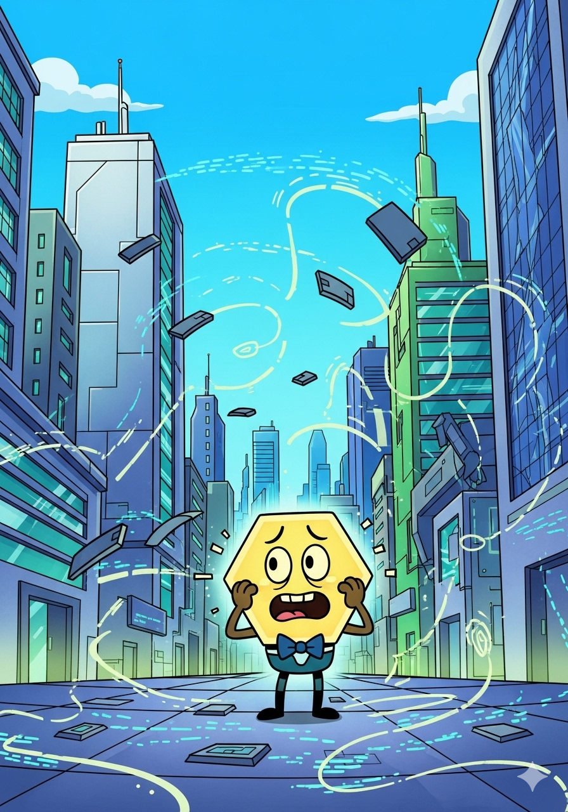
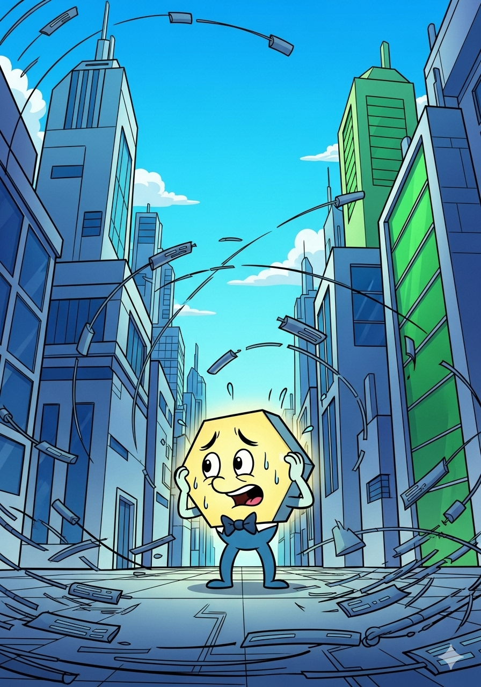
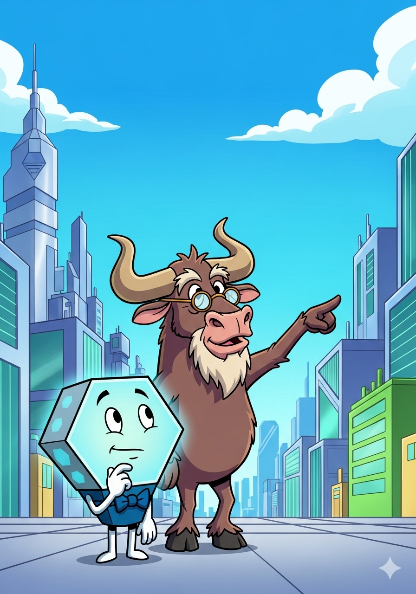
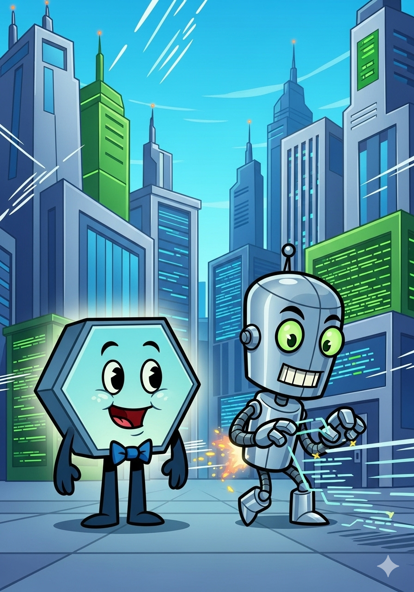
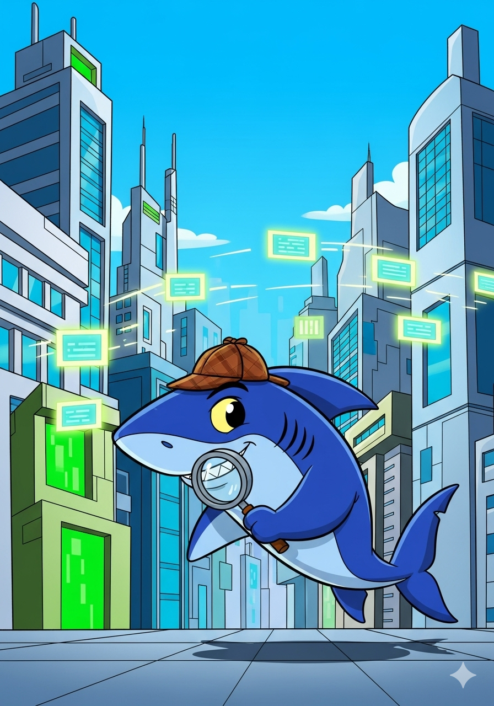
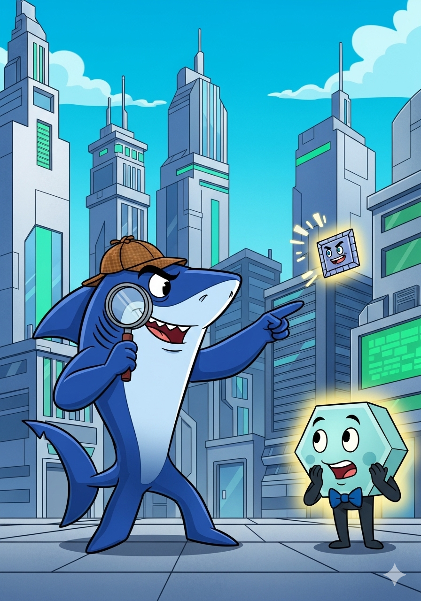
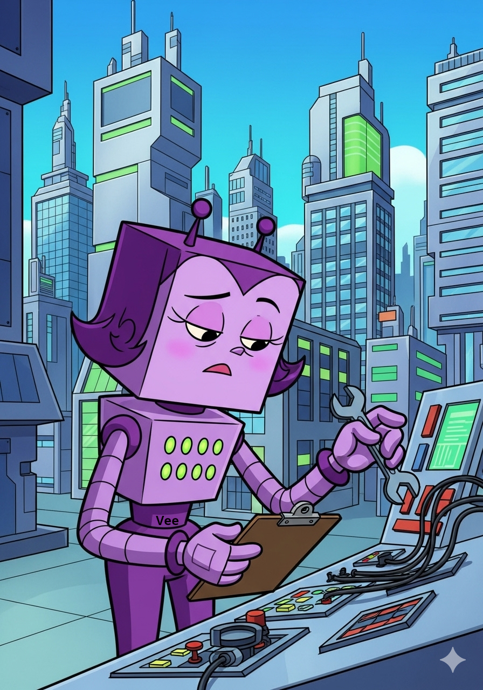
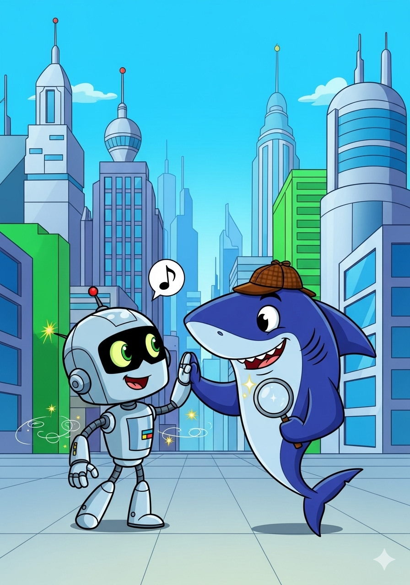
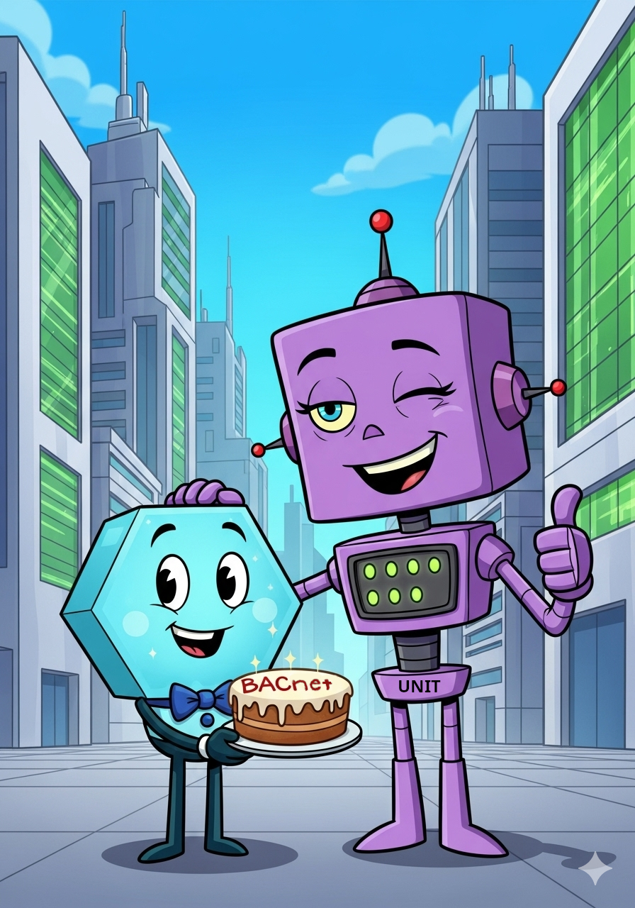

# The BACnet Stack Bake Off

In the bustling digital city of Connectville,
lived a little protocol named Bax.
Bax was a very important protocol,
but sometimes, he felt a bit... alone.
His job was to help buildings talk to each other,
but all the building did not
want to share their instructions!

One sunny morning, Bax wondered aloud,
"If only my instructions were clear,
everyone could use me easily!"
Just then, a wise old Gnu with spectacles,
named Gnu, trotted by.
"Ah, young Bax," Gnu said,
"You need the magic of Free and Open Source!"

Gnu explained that Free and Open Source
meant sharing and working together.
"Imagine everyone helping to bake the perfect cake,
instead of everyone baking alone!" Bax's eyes lit up.
A cake sounded much tastier than hidden instructions!

Soon, other friendly characters joined the team.
First was Clang, a speedy little compiler who loved
turning jumbled ideas into neat, organized instructions.
"Zip, zap, zoom!" Clang would say, tidying up Bax's code.

Next came Sharky, a super-sleuth who could
see every little byte of information
flowing through Connectville.
Sharky was like a detective,
always peeking into the data
to make sure everything was going
where it should.

"Aha!" Sharky would exclaim, pointing a fin.
"A tiny typo on line 73!
Or perhaps a rogue packet trying to sneak past!"
Bax was amazed at how much Sharky could see.

And finally, there were Vee and Unit,
the meticulous testers.
Vee and Unit loved to try out
every single connection and instruction,
making sure Bax's messages always got through perfectly.
"One, two, three, test!" they would chant,
checking every connection and instruction.

With Gnu's wisdom, Clang's speed,
Sharky's sharp eyes, Unit and Vee's thoroughness,
Bax's instructions became the clearest in all of Connectville.
Buildings hummed happily,
communicating without a single hiccup.

"It's like a grand symphony!" exclaimed Bax,
as all the parts worked together in harmony.
"And it's all thanks to sharing and working as a team!"

From that day on, Bax and his friends continued
to make BACnet development a breeze,
proving that when everyone shares their talents,
even the most complex tasks can be a piece of cake!
Or, in this case, a perfectly baked protocol stack!

**Story and images created by Google Gemini.**
**Prompted and Edited by Steve Karg**

**ASHRAE® and BACnet® are registered trademarks of the
American Society of Heating, Refrigerating and Air-Conditioning Engineers, Inc.
180 Technology Parkway NW, Peachtree Corners, Georgia 30092 US.**

