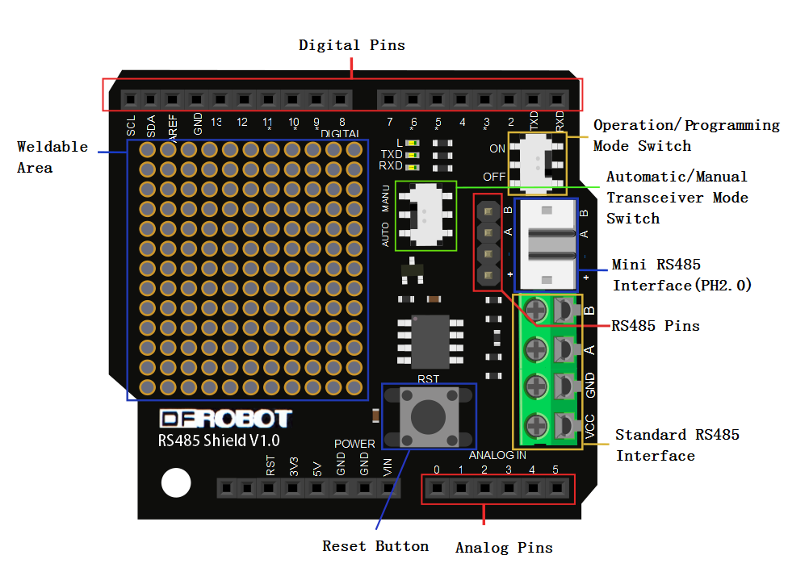
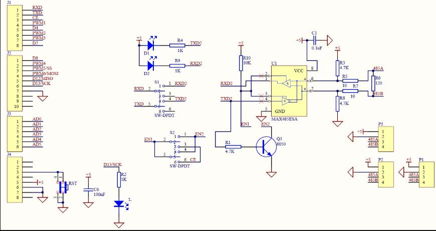

# Introduction

This is an Arduino RS485 shield, especially designed for the Arduino
controller board. It can easily convert the UART to the RS485.
This shield integrates:

* a standard RS485 port
* a mini RS485 port (PH2.0 interface)
* RS485 headers
* provides the prototyping areas
* configurable automatic or manual transmission (RTS) mode
* configurable operation or programming mode

# Specification

* Power module: +5.0V
* Module size: 55mmx53mm
* 16 digital IO port (including a I2C interface)
* 6 analog IO port and power
* Operation/programming mode switch
* Automatic/manual transceiver mode switch (When in manual transceiver mode, the enable end is the 2nd digital IO port)
* Transceiver indicating LED
* Standard RS485 interface, mini RS485 interface(PH2.0) and RS485 pins
* prototyping area
* Reset button

# Pin Definition

## Operation and programming mode switch:

* To OFF, you can download the program for the Arduino controller.
* To ON, the shield will convert the UART to the RS485.

## Transceiver mode switch:

* To AUTO, the shield is automatically sending and receiving data so you
  do not care about operation timing
* To MANU, the shield is in manual transceiver status, and the enable end
  is the 2nd digital IO port. Enabling high-side power Ping to sending
  state while the low level of the receiving state.

# Usage Setup

When the RS485 shield is installed on your Arduino controller,
and then you will wire the RS485 shiled with USB-RS485 converter
to connect terminals, namely: A pair of A, B on B, GND on GND,
then download the following sample code.

Note: Downloading code, run / program mode switch must hit the OFF position,
otherwise it will lead to the download fails. When downloaded, it is complete
to ON, and the shield to normal use).

# Schematic

