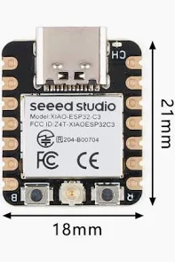
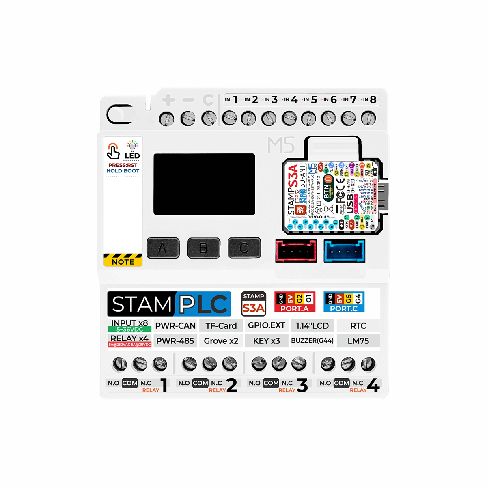
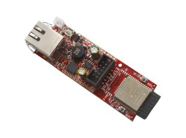

# ESP32 Port

Date: 2026-04-04
Author: Kato Gangstad

This folder contains the ESP32 BACnet port built with PlatformIO.
It targets multiple ESP32-family boards and covers BACnet MS/TP, BACnet/IP, and BACnet Gateway (based on apps/gateway2) profiles.
It is based on the current lwIP port and Pico port patterns in this repository.

## Current Scope

- BACnet MS/TP transport for ESP32 boards with RS485
- BACnet/IP transport for compact WiFi and Ethernet ESP32 targets
- BACnet routing between BACnet/IP and BACnet MS/TP

## Port Identity

It is the ESP32 BACnet port for the current PlatformIO-based targets in this repository.

## Supported Board Profiles

The current board coverage includes:

- Seeed Studio XIAO ESP32C3 for ultra-compact BACnet/IP
- M5StamPLC for BACnet MS/TP and BACnet router builds
- Olimex ESP32-POE for BACnet/IP

The upstream BACnet stack has a broad source set and multiple app profiles.
This port selects the ESP32-specific transport, board, and application wiring needed for the environments documented below.

## Files

- src/main.cpp: Application loop, BACnet object table, and PLC I/O sync
- src/mstimer_init.c: millisecond timer hook used by mstimer
- src/rs485.c: ESP32 RS485 low-level driver for MS/TP
- src/dlenv.c: MS/TP datalink environment setup and port wiring
- src/bip_socket.cpp: BACnet/IP UDP socket bridge for WiFi and Ethernet targets
- extra_script.py: Injects BACnet core/basic sources into the PlatformIO build

## Build Notes

1. Open this folder as a PlatformIO project root, or run PlatformIO with this folder as cwd.
2. Start with the environment that matches your board and transport profile.
3. The `platformio.ini` file defines all tested board environments for this port.
4. Ensure PlatformIO CLI is available in your shell (`pio --version`).
5. Build with `pio run -e <environment-name>`.

## Tested Environments

The following PlatformIO environments have been built and uploaded successfully:

- `xiao-esp32c3-wifi-bip` on Seeed Studio XIAO ESP32C3
- `m5stamplc-mstp` on M5StamPLC
- `m5stamplc-gateway-bip-mstp` on M5StamPLC
- `esp32-poe-wifi-bip` on Olimex ESP32-POE

## Validation Tools

Interoperability and functional verification have been tested with:

- YABE
- Honeywell Eaglehawk 4.15
- Tridium Niagara 4.15

## Board Pictures

The following board photos document the hardware used for the tested environments.

### Seeed Studio XIAO ESP32C3

Used for:

- `xiao-esp32c3-wifi-bip`

Why this board stands out:

- Extremely compact form factor for a BACnet/IP target
- Physical size: 21 x 17.8 mm
- Strong candidate for one of the smallest BACnet/IP device ever !

Hardware summary:

- MCU: ESP32-C3
- CPU type: 32-bit single-core RISC-V
- CPU clock: 160 MHz
- RAM: 320 KB
- Flash: 4 MB

### M5StamPLC

- BACnet server object model with Device + Binary Input + Binary Output objects
- Runtime mapping:
  - BI 0..7 <- PLC inputs 1..8
  - BO 0..3 -> PLC relays 1..4
- RS485 pin mapping aligned with the M5StamPLC hardware profile:
  - TX: GPIO0
  - RX: GPIO39
  - DIR: GPIO46

Used for:

- `m5stamplc-mstp`
- `m5stamplc-bip`
- `m5stamplc-gateway-bip-mstp`
- soon to come `m5stamplc-poe-bip`

Hardware summary:

- MCU: ESP32-S3
- CPU clock: 240 MHz
- RAM: 320 KB
- Flash: 8 MB

### Olimex ESP32-POE

Used for:

- `esp32-poe-wifi-bip`
- `esp32-poe-eth-bip`

Hardware summary:

- MCU: ESP32
- CPU clock: 240 MHz
- RAM: 320 KB
- Flash: 4 MB

